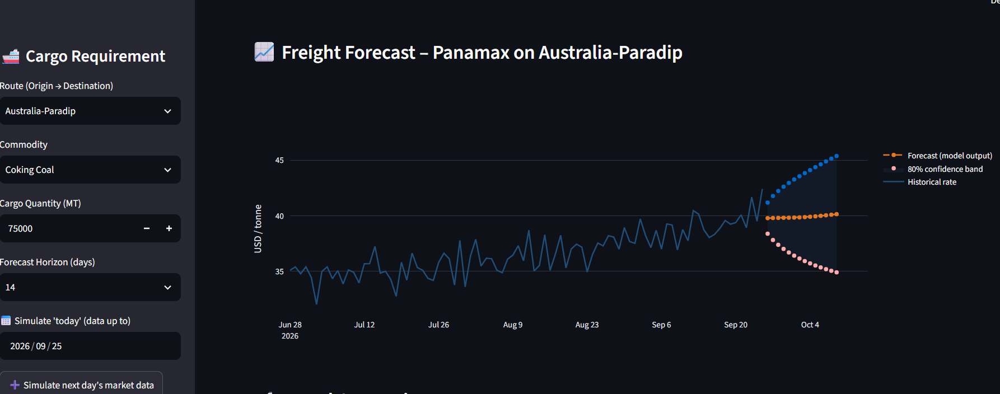
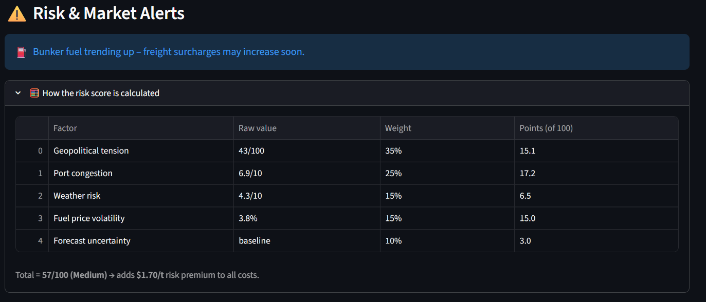
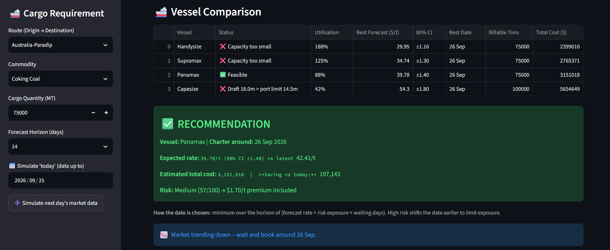

# 🚢 FreightIQ: Intelligent Freight Forecasting & Vessel Chartering System

**FreightIQ** is a predictive decision engine built for the **Ministry of Steel** to optimize bulk cargo vessel chartering. It replaces reactive, manual market checks with data-driven forecasting, physical vessel feasibility checks, and dynamic risk scoring.

> 🏆 **Smart India Hackathon 2026** | Problem Statement: **SIH26006** | Team: **Zenith**

---

### 📸 Prototype Screenshots

| Forecast Graph | Risk Engine Breakdown | Dashboard & Split-Cargo Planner (150k MT) |
| :---: | :---: | :---: |
|  |  |  |

---

### 🚀 Key Features
* **7-30 Day Freight Forecasting:** Uses Harmonic Regression with real global market indices (Baltic Dry Index via `yfinance` & Brent Crude).
* **Physical Vessel Feasibility:** Checks cargo capacity, port draft limits, and dead-freight penalties.
* **Dynamic Risk Engine:** 5-factor weighted scoring (Geopolitics, Congestion, Weather, Fuel Volatility, Uncertainty) converted into a $/tonne risk premium.
* **Split-Cargo Automation:** Automatically plans multi-voyage splits for oversized parcels that exceed single-vessel limits.
* **80% Confidence Bands:** Statistical uncertainty modeling to prevent over-reliance on point forecasts.

---

### 🛠️ Tech Stack
* **Core Engine:** Python 3.11, Pandas, NumPy
* **Math & Modeling:** Custom NumPy Harmonic Regression, SciPy
* **Frontend:** Streamlit, Plotly
* **Data Hooks:** yfinance (Brent Crude `BZ=F`, BDI `^BDI`), RESTful architecture

---

### ⚙️ How to Run Locally

1. **Clone the repository:**
   ```bash
   git clone https://github.com/VISHAL101006/FreightIQ.git
   cd FreightIQ

2. Install dependencies:

        pip install -r requirements.txt

3. Generate / refresh market data:

        python generate_data.py

4. Launch the dashboard:

        streamlit run app.py

## 📊 Data Sources & Methodology

- **Market indices:** Baltic Exchange (BDI); Brent Crude via yfinance.
- **Port metrics:** NITI Aayog NDAP, MoPSW, MoSPI compendium.
- **Academic backing:** Journal of Shipping & Trade (2024), JOIV (2025), DergiPark (2023).

---

*Built with ❤️ by Team Zenith for Smart India Hackathon 2026.*